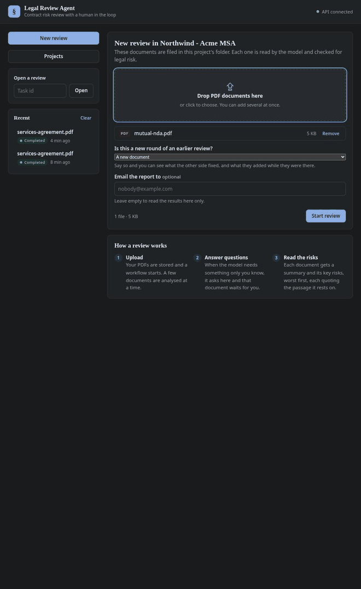
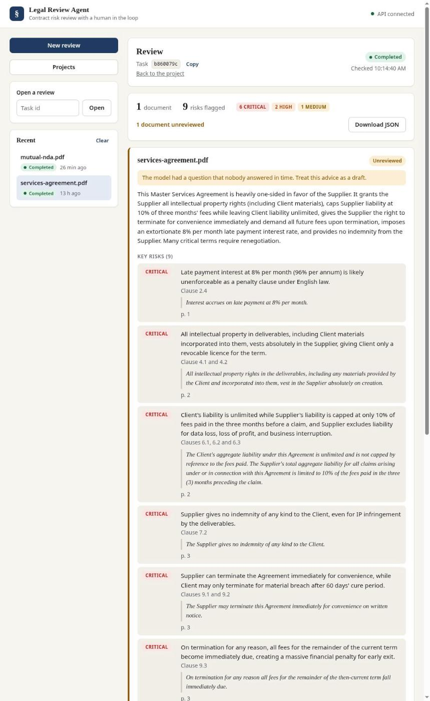
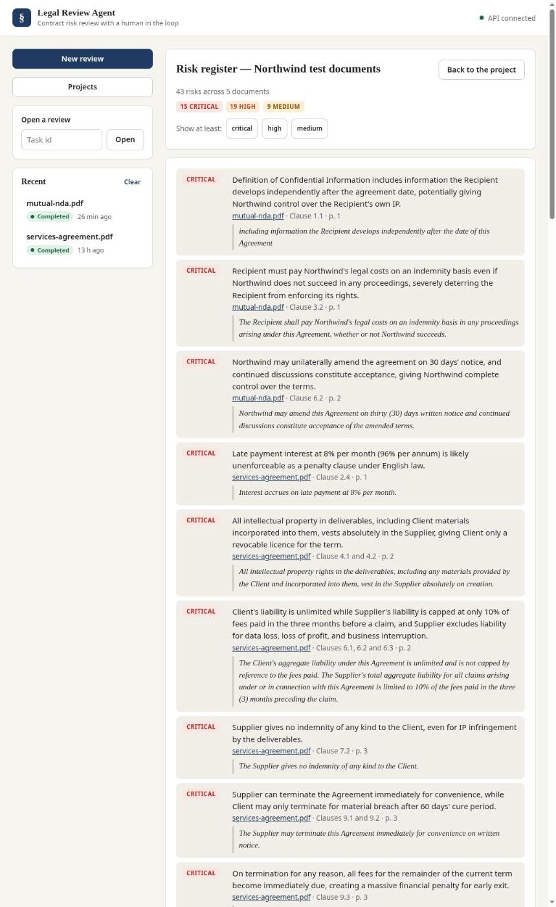
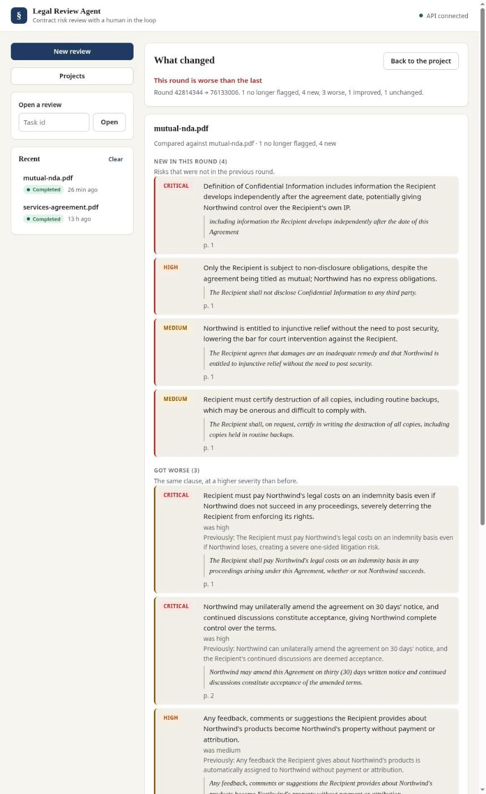
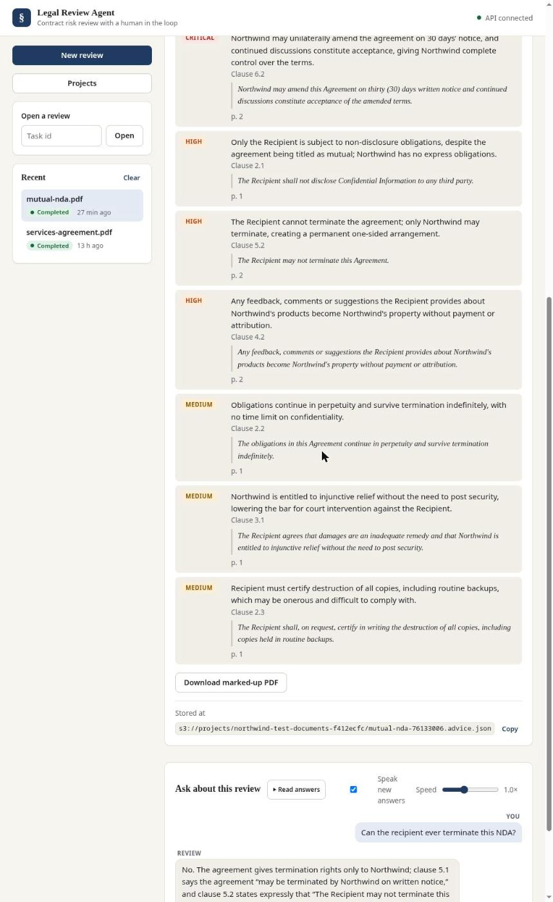
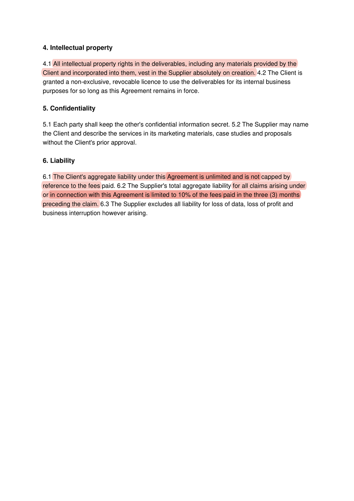
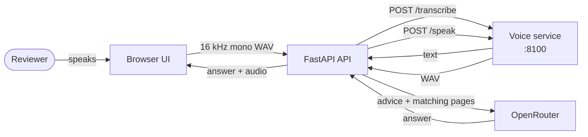
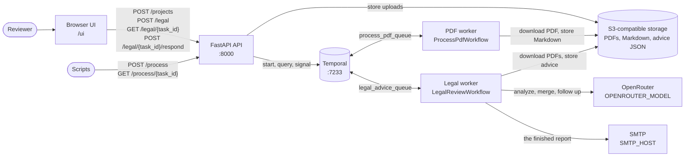

# Legal Review Agent

A FastAPI service with two Temporal pipelines over S3-compatible object storage:

- **Legal review** (`POST /legal`): upload several PDFs and a language model
  reviews each one for legal risk: a summary, the key risks with a severity and
  a location, and a pause for a human whenever the model needs a fact only the
  client knows. Each document's advice is stored as JSON and can be read as
  soon as that document finishes.
- **PDF to Markdown** (`POST /process`): upload a PDF and the service stores the
  original, parses it with
  [pymupdf4llm](https://pymupdf.readthedocs.io/en/latest/pymupdf4llm/), stores
  the resulting Markdown, and pulls that Markdown back onto local disk for
  inspection.

Reviews can be filed in a **project**: a folder in the bucket with a name, an
optional description and an optional address the finished report is emailed to.
A finished review can then be **asked questions**, by typing or out loud, with
the speech models running in a service of their own.

Each pipeline is a Temporal workflow on its own task queue, served by its own
worker, and a browser UI served by the API drives the legal review.

## Contents

- [Screenshots](#screenshots)
  - [A finished review](#a-finished-review)
  - [The risk register](#the-risk-register)
  - [What changed between two rounds](#what-changed-between-two-rounds)
  - [Asking about the review, by voice](#asking-about-the-review-by-voice)
  - [The contract, marked up](#the-contract-marked-up)
  - [Temporal](#temporal)
- [The complete workflow](#the-complete-workflow)
  - [What you can do with a finished review](#what-you-can-do-with-a-finished-review)
  - [The same thing as a script](#the-same-thing-as-a-script)
  - [What guards what](#what-guards-what)
  - [Measuring it](#measuring-it)
- [How it works](#how-it-works)
  - [PDF to Markdown](#pdf-to-markdown)
  - [Legal review](#legal-review)
  - [Projects](#projects)
  - [The emailed report](#the-emailed-report)
  - [Asking questions, by voice](#asking-questions-by-voice)
- [Layout](#layout)
  - [Architecture](#architecture)
  - [Directory tree](#directory-tree)
- [Requirements](#requirements)
- [Setup](#setup)
  - [Environment variables](#environment-variables)
- [Running](#running)
  - [Locally](#locally)
  - [With the workers in Docker](#with-the-workers-in-docker)
  - [Ports](#ports)
  - [Browser UI](#browser-ui)
- [API](#api)
  - [`GET /health`](#get-health)
  - [`POST /process`](#post-process)
  - [`GET /process/{task_id}`](#get-processtask_id)
  - [`POST /projects`](#post-projects)
  - [`GET /projects`](#get-projects)
  - [`GET /projects/{project_id}`](#get-projectsproject_id)
  - [`GET /projects/{project_id}/reviews/{task_id}`](#get-projectsproject_idreviewstask_id)
  - [`GET /projects/{project_id}/register`](#get-projectsproject_idregister)
  - [`GET /projects/{project_id}/compare`](#get-projectsproject_idcompare)
  - [`GET /legal/{task_id}/annotated`](#get-legaltask_idannotated)
  - [`POST /legal`](#post-legal)
  - [`GET /legal/{task_id}`](#get-legaltask_id)
  - [`POST /legal/{task_id}/respond`](#post-legaltask_idrespond)
  - [`POST /projects/{project_id}/reviews/{task_id}/chat`](#post-projectsproject_idreviewstask_idchat)
  - [`POST /voice/transcribe`](#post-voicetranscribe)
  - [`POST /voice/speak`](#post-voicespeak)
  - [`GET /projects/{project_id}/reviews/{task_id}/audio/{turn}/{kind}`](#get-projectsproject_idreviewstask_idaudioturnkind)
  - [Errors](#errors)
  - [Task ids](#task-ids)
- [Authentication](#authentication)
- [Running on a local model](#running-on-a-local-model)
- [Tests](#tests)
- [Evaluating the review](#evaluating-the-review)
- [Code quality](#code-quality)
- [Exceptions](#exceptions)
- [Temporal activities](#temporal-activities)
  - [Logging](#logging)
  - [The workflow](#the-workflow)
  - [One directory per worker](#one-directory-per-worker)
  - [Running a worker in Docker](#running-a-worker-in-docker)
  - [Persistent scratch space](#persistent-scratch-space)
- [License](#license)

## Screenshots

One real use case, end to end: upload a contract, watch the review run, read
the risks, then ask about them. Nothing here is staged — it is a recording of an
actual review, which took about twenty seconds on a local model running on a
laptop GPU.



### A finished review

The totals and risks by severity, then one card per document: its review
decision, summary, and every risk with the clause it rests on, the page, and the
passage quoted word for word. `Download marked-up PDF` hands back the contract
itself.



### The risk register

Every risk across the whole project, worst first, each linking back to the
review it came from. 43 risks over 5 documents here, filtered to a severity
floor without a round trip.



### What changed between two rounds

Round two against round one: what was fixed, what is new, and what got worse,
with the previous wording kept beside the new. No model call — it is quote
matching, so it costs nothing and says the same thing every time.



### Asking about the review, by voice

The chat panel reads the review and the documents back. `Read answers` speaks
every answer in the thread, highlighting each word as it is said.



### The contract, marked up

The original PDF with each verified quote highlighted in its severity's colour
and the finding attached as a note. Only verified quotes are highlighted;
anything the evidence check could not place goes on an appendix page rather than
being dropped.



### Temporal

Finished reviews in the Temporal web UI, one `legal-review-<task_id>` workflow
per review:


The timeline of one review: three documents downloaded and split side by side,
an `analyze_batch` call per page batch (one of them retried), a `merge_advice`
per document, and then one document waiting on a human, the one-hour timer,
until the `human_response` signal arrives and `human_followup` revises its
advice before `upload_advice` stores it.


## The complete workflow

End to end, from a PDF nobody has read to something a lawyer can act on. Every
stage is optional except the first three — a review with no project, no email,
no questions and no export is still a review.

```mermaid
sequenceDiagram
    autonumber
    actor You
    participant API as FastAPI
    participant S3 as Bucket
    participant T as Temporal
    participant W as Legal worker
    participant M as Model

    You->>API: POST /legal (files, project_id, email, supersedes)
    API->>API: stream to disk, check %PDF-, bound the size
    API->>S3: store the PDFs, delete the local copies
    API->>T: start LegalReviewWorkflow (keys, never bytes)
    API-->>You: 202 + task_id

    loop each document, LEGAL_MAX_CONCURRENT_PDFS at a time
        T->>W: download_pdf, split_pages
        loop each batch of LEGAL_PAGES_PER_BATCH pages
            W->>M: analyze_batch
            M-->>W: risks, each with a quote
            W->>W: check every quote against the page
        end
        W->>M: merge_advice
        M-->>W: one review for the document

        alt the model needs a fact the document lacks
            W-->>You: needs_human + the question
            Note over W: gives up its concurrency slot and waits<br/>HUMAN_INPUT_TIMEOUT_SECONDS
            You->>API: POST /legal/{task_id}/respond
            API->>T: human_response signal
            T->>W: the answer
            W->>M: human_followup
            M-->>W: the revised review
        else nobody answered in time
            Note over W: the draft is kept and flagged unreviewed
        end

        W->>S3: upload_advice
        W->>W: cleanup_scratch
    end

    W-->>You: the emailed report, if an address was given
    You->>API: read it, ask about it, compare it, export it
```



### What you can do with a finished review

Everything below reads the advice back out of the bucket, so it keeps working
after Temporal has dropped the workflow's history.

| | |
| --- | --- |
| Follow it while it runs | `GET /legal/{task_id}` |
| Read it ever after | `GET /projects/{id}/reviews/{task_id}` |
| Ask about it | `POST .../chat`, `POST .../chat/stream` — text or voice |
| Hear it | `POST /voice/speak` — with word timings, so the page highlights each word as it is read |
| See the whole client | `GET /projects/{id}/register` — every risk, worst first |
| Compare round two | `GET /projects/{id}/compare` — fixed / new / worse |
| Hand it over | `GET /legal/{task_id}/annotated` — the PDF, highlighted |

### The same thing as a script

```bash
KEY="$API_KEY"                      # empty if API_KEY is not set
API=http://localhost:8000

# 1. a folder for this client
project=$(curl -s -X POST $API/projects -H "X-API-Key: $KEY" \
  -H 'Content-Type: application/json' \
  -d '{"name":"Northwind","email":"counsel@example.com"}' | jq -r .id)

# 2. the contracts
task=$(curl -s -X POST $API/legal -H "X-API-Key: $KEY" \
  -F files=@services-agreement.pdf -F files=@mutual-nda.pdf \
  -F project_id="$project" | jq -r .task_id)

# 3. follow it; it reports awaiting_human when the model has a question
curl -s $API/legal/$task -H "X-API-Key: $KEY" | jq '{status, documents}'

# 4. answer the question, if it asked one
curl -s -X POST $API/legal/$task/respond -H "X-API-Key: $KEY" \
  -H 'Content-Type: application/json' \
  -d '{"pdf_key":"'"$project"'/services-agreement-a1b2c3d4.pdf",
       "answer":"The client is Northwind; treat them as the customer."}'

# 5. the whole client in one list, criticals only
curl -s "$API/projects/$project/register?minimum=critical" -H "X-API-Key: $KEY" | jq .counts

# 6. the marked-up contract
curl -s -H "X-API-Key: $KEY" \
  "$API/legal/$task/annotated?pdf_key=$project/services-agreement-a1b2c3d4.pdf&project_id=$project" \
  -o services-agreement-reviewed.pdf

# 7. when they send round two, upload it with --form supersedes="$task", then
curl -s "$API/projects/$project/compare?base=$task&against=$round2" -H "X-API-Key: $KEY" | jq .totals
```

### What guards what

| Stage | What protects it |
| --- | --- |
| Upload | `%PDF-` magic bytes, per-file and per-request size limits, all-or-nothing storage |
| Every route | `X-API-Key` (`utils/auth.py`); `/health` and the UI stay open |
| Model replies | `LegalAdvice.from_model` — a bad *reply* is retried, a bad *risk* is dropped and counted |
| Every quote | `utils/evidence.py` checks it against the page; unverified quotes are flagged everywhere they appear |
| Workflow changes | `tests/test_workflow_replay.py` replays captured histories, so a change cannot break a review already in flight |
| Prompt changes | `evaluation/` — the fixture suite on every change, CUAD periodically |
| Scratch files | `cleanup_scratch` in a `finally`, so a failed review cleans up too |

### Measuring it

The pipeline above is the product. [`evaluation/`](evaluation/README.md) is how
you find out whether a change to it helped: three layers over CUAD, a fast
fixture suite over invented contracts, and one model per level so nothing grades
its own output. It can run entirely on a local model, for nothing — see
[Running on a local model](#running-on-a-local-model).

## How it works

### PDF to Markdown

`POST /process` stores the upload, then hands the work to Temporal:

1. The route writes the PDF into `TEMP_PDF_FOLDER` and uploads it to
   `S3_PDF_BUCKET`, then starts `ProcessPdfWorkflow` with just the two keys
2. `download_pdf` pulls the PDF onto whichever worker picked up the task
3. `parse_pdf` converts it to Markdown with pymupdf4llm
4. `upload_md` writes the Markdown to `S3_PARSED_MDS`
5. `download_md` pulls it back into `TEMP_MD_FOLDER`

The document itself never travels through the workflow history: the route
uploads it first and the workflow passes only keys, which is also why the
worker does not need to share a filesystem with the API.

Each run gets a short random id, so `report.pdf` uploaded twice becomes
`report-a1b2c3d4.pdf` and `report-9f8e7d6c.pdf` rather than overwriting itself.
Both the PDF and its Markdown share the same run id, and the workflow id is
derived from the PDF key so a retried upload deduplicates.

Retry behaviour comes from named policies in `enums/RetryPolicy/` rather than
being spelled out at each call site: `StorageRetryPolicy()` retries three times
with a one-second initial backoff, `ParsingRetryPolicy()` twice with a
five-second one, and `StrictRetryPolicy()` does not retry at all. Storage steps
time out after a minute, parsing after ten.

### Legal review

`POST /legal` accepts up to `LEGAL_MAX_PDFS` documents in one request, stores
each in `S3_PDF_BUCKET` under its own key, and starts one `LegalReviewWorkflow`
(`legal-review-<task_id>`) on `LEGAL_TASK_QUEUE`. For every document it runs:

1. `download_pdf` pulls the PDF onto the worker (the same activity the other
   pipeline uses)
2. `split_pages` parses it page by page and groups the pages into batches of
   `LEGAL_PAGES_PER_BATCH`
3. `analyze_batch` sends the batches to the model one at a time and validates
   each reply into a summary and a list of key risks
4. `merge_advice` consolidates the batches into one review; a document that fit
   in a single batch skips this call
5. if the model asked a question, the document waits for
   `POST /legal/{task_id}/respond`, and `human_followup` revises the advice
   with the answer
6. `upload_advice` writes the advice JSON to `S3_LEGAL_ADVICE` as
   `<pdf key without .pdf>.advice.json`

**Concurrency.** At most `LEGAL_MAX_CONCURRENT_PDFS` documents (default 10) are
in flight at once. The limit is a semaphore inside the workflow rather than a
worker setting, so it holds however many worker processes are running. A
document waiting on a human is not in flight: it gives its slot back for the
wait and takes one again only to revise its advice, so open questions cannot
stall the rest of the review. On the worker, the blocking steps (the S3
download and upload, and parsing) run in threads, so one document's I/O does
not hold up the model calls of the others. PyMuPDF is not thread-safe, so
parsing goes through a lock and runs one document at a time.

**Human in the loop.** The model decides when it needs a human: it sets
`needs_human` and asks one question. The review then reports `awaiting_human`
and lists the question under `pending_questions`. If nobody answers within
`HUMAN_INPUT_TIMEOUT_SECONDS` (an hour by default), the document finishes
anyway with the draft advice, marked `unreviewed_timeout` and
`needs_attention`, so the work already done is not thrown away. Advice revised
with an answer is `human_approved`; advice that never needed a human is
`auto_approved`.

**Results as they finish.** The workflow publishes each document's advice the
moment it is stored, so `GET /legal/{task_id}` returns finished documents under
`results` while the rest of the review is still running.

**Evidence.** Every risk must quote the passage it rests on, word for word,
and give its page. Each page of a batch opens with a `<!-- page N -->` marker,
so the model can cite real page numbers. The quote is then checked in code
(`utils/evidence.py`), not taken on trust. It counts as verified only if it
appears in the batch it came from, after both sides are normalized (case,
whitespace, curly quotes, Markdown), or if a close fuzzy match covers 90% of
it. The page where it was found replaces the page the model claimed. Quotes
under 15 characters never count. A quote that can't be found keeps its risk
but is marked `quote_verified: false`, and the UI flags it as an "Unverified
quote". The merge and the human follow-up never see the pages, so a risk stays
verified after them only if its quote is one that was already verified, or
part of one.

**Batching and the model.** Each batch of up to `LEGAL_PAGES_PER_BATCH` pages
(default 30) is one model call, plus one merge call per document with more
than one batch. A reply may be up to `LLM_MAX_TOKENS` long (default 16000),
which leaves room for the merged review of a large document with many risks,
and a call may take up to `LLM_TIMEOUT_SECONDS` (default 300).

A reply cut off at the token limit is an error, not something to salvage:
repairing it would silently drop every risk the model had not written yet.
Raise `LLM_MAX_TOKENS` or lower `LEGAL_PAGES_PER_BATCH` if it happens. A reply
that is complete but malformed (wrapped in a code fence or prose, a trailing
comma, unquoted keys) is repaired with
[json-repair](https://github.com/mangiucugna/json_repair) and the repair is
logged; one that still is not a JSON object is rejected. Every reply is then
validated before it is trusted: an unknown severity, a missing summary, or
`needs_human` without a question fails the activity, and `LLMRetryPolicy()`
gives model calls three attempts, backing off from ten seconds.

The model is whatever `OPENROUTER_MODEL` names. The client asks for JSON output
and validates the reply either way, so choose a model that follows JSON
instructions reliably. Activities ask `interfaces.get_llm()` for the model and
never import a vendor client, so another provider is one more `LLMInterface`
implementation registered in `interfaces/llm_factory.py`.

### Projects

A project is a folder in `S3_PROJECTS` that a client's reviews are filed
under. `POST /projects` takes a name, an optional description and an optional
email address, and writes the manifest that brings the folder into being — S3
has no directories, so a prefix exists because objects use it:

```text
projects/                               the bucket
└── acme-ndas-b4b731b4/
    ├── project.json                    name, description, email, created_at
    ├── contract-a1b2c3d4.pdf           the documents uploaded into it
    ├── contract-a1b2c3d4.md            their parsed text
    ├── contract-a1b2c3d4.advice.json   and their advice
    ├── reviews/
    │   └── a1b2c3d4.json               task id, workflow id, pdf keys, when
    └── chats/
        ├── a1b2c3d4.json               the questions asked about that review
        └── a1b2c3d4/audio/0-question.wav
```

Everything a project owns is in that one bucket, so a single lifecycle rule
covers it and removing a client is one prefix to delete. The documents of a
review outside a project still go to `S3_PDF_BUCKET`, `S3_PARSED_MDS` and
`S3_LEGAL_ADVICE`, as does the PDF-to-Markdown pipeline, which has no project.
Which bucket to read or write is passed to each activity rather than assumed,
so a worker never has to guess from the shape of a key.

The id is the name's slug plus a short random suffix, so two projects called
"NDAs" cannot share a folder. Each review is its own object rather than a list
inside the manifest, so two submissions at the same moment cannot overwrite
each other's record.

`POST /legal` takes an optional `project_id`: the documents are stored under
that prefix in the projects bucket, their text and advice follow them there,
and the review is recorded against the project.

The bucket is what remembers a project, and that matters beyond tidiness.
Temporal deletes a closed workflow's history when its retention period passes,
after which `GET /legal/{task_id}` reports 404 —
`GET /projects/{project_id}/reviews/{task_id}` still answers, because it reads
the stored advice rather than the workflow. The browser UI falls back to it
automatically for a review it knows the project of.

### The emailed report

A review with an address — the project's, or one given for that review — emails
its report as the last step of the workflow: the totals by severity, then each
document with its decision, summary and risks, each risk quoting the passage it
rests on, with the full advice JSON attached. Every value the model produced is
escaped before it goes in.

`activities/send_report.py` sends it, so Temporal retries a mail server that is
briefly unreachable. Two failures are deliberately not the same:

- **no SMTP configured** is reported, not raised. The review succeeded, and
  retrying cannot conjure a mail server.
- **a server that refuses the message** raises, and `StorageRetryPolicy()`
  gives it three attempts.

Either way the review still completes. The advice is in the bucket and the API
serves it; losing a finished review over an email would be absurd.

### Asking questions, by voice

A finished review in a project has a chat panel: ask what the liability cap is,
whether there is a non-compete, what to negotiate first. The answer comes from
the stored advice plus the pages of the documents that match the question, and
cites the page it used.



**Which pages.** `utils/retrieval.py` scores every page of every document in
the review against the question by term overlap and takes the best ones within
`CHAT_CONTEXT_CHARACTERS`. It rides on the `<!-- page N -->` markers the
batching already writes, so no index is built, nothing has to be kept in sync
with the bucket, and you can see why a page was chosen.

When nothing matches, the documents themselves are sent instead, from the
beginning, with the budget shared between them so a long contract cannot crowd
out the short one beside it — and the model is told that is what it is reading.
A question worded nothing like the contract ("is this worth signing?") would
otherwise be answered from the summary alone, which is thinner than the
document being asked about. A question that *did* match keeps just its pages,
and the citation stays honest.

The documents' text is stored during the review by `split_pages`, which already
has it parsed, so the review pays for it once. A document reviewed before this
existed still answers from its advice, it simply cannot be quoted.

**The thread** lives at `projects/<id>/chats/<task_id>.json`, beside the review
rather than in whichever browser asked, so it survives a reload and outlives
Temporal's retention window. Chat is offered on project reviews only: a review
started outside a project has no durable home to read back from.

**Playback** has play, pause and resume on each answer, and a speed slider
beside the read-aloud toggle, 0.5× to 2×, remembered per browser. The slider
moves what is playing right now, not just the next clip: drag it mid-answer and
the voice speeds up under your hand, with the pitch held so it still sounds
like the same speaker.

**The word being read is highlighted in yellow**, and not by guesswork: Kokoro
reports the start and end of every word it speaks, so the highlight lands on
the word being said and moves off when the voice does — through a pause, a
resume and a change of speed, because it follows the audio's own clock. The
timings are stored beside the recording, so a replay follows along too. An
engine that cannot report them (Qwen3-TTS cannot) simply does not highlight; a
marker drifting a sentence behind the voice would be worse than none.
It is the most effective thing available against a long answer: warm, the model
generates a little faster than realtime, so most of the wait is the length of
the answer itself rather than the synthesis. The numbers are in
[voice/README.md](voice/README.md#speed).

**Speech** runs in `voice/`, its own uv project with its own image, because
torch and transformers are gigabytes and the API and workers have no use for
them. The browser records, decodes and resamples to 16 kHz mono WAV itself, so
no ffmpeg is needed server-side, and the API proxies both directions so the
browser never talks to the GPU box. With the voice service stopped, typing
still works — the microphone is an input method, not the feature. See
[voice/README.md](voice/README.md).

**The models** are `Qwen/Qwen3-ASR-0.6B` for listening and
`oddadmix/Kokoro-7M-Distill` for speaking, both Apache 2.0. The voice is a
7.5M-parameter distillation: 31 ms of GPU work for nine seconds of speech,
about 40 MB of VRAM, roughly three hundred times faster than listening to it.
`Qwen/Qwen3-TTS-12Hz-0.6B-CustomVoice` remains behind `TTS_ENGINE=qwen` for the
nine languages Kokoro does not speak. `VOICE_QUANTIZATION` defaults to `4bit`,
which the recogniser takes (1.2 GB of VRAM instead of 2.5). Three notes
for anyone retracing the choice. Ollama serves language models only and cannot
host either of these. Coqui XTTS v2 — the obvious TTS candidate — is released
under a non-commercial licence by a company that shut down in 2024. And the two
Qwen packages each pin `transformers` to an exact patch, so one of the pins has
to win; `voice/pyproject.toml` says which and why.

**The recordings** are kept beside the thread, at
`<project_id>/chats/<task_id>/audio/<turn>-question.wav` for what was asked and
`<turn>-answer.ogg` for what was said back, in the projects bucket. Answers are
Opus — a tenth the size of the same speech as WAV, 21 KB against 210 KB for a
sentence — which matters because every answer is stored and fetched again to
replay it. Questions stay WAV: the recogniser wants samples, not a codec's idea
of them. Clips stored before this are WAV and still play; the extension on the
key says which. S3 rather than a database or a local file: they are blobs, the
bucket is already where everything durable here lives, a local file dies with
the container, and a database row would only hold a pointer to the bucket
anyway. Playing an answer again reads the stored clip instead of synthesising
it twice. `STORE_AUDIO=false` keeps the transcript and drops the audio — it is
a recording of someone discussing a client's contract, which is worth being
deliberate about.

## Layout

### Architecture



The API never does the heavy work itself. It stores each upload in S3, starts
a workflow on the right task queue, and from then on only talks to Temporal:
it queries a running review for its progress, pending questions and finished
results, and turns an answer from the UI into the `human_response` signal. Each
worker polls its own queue, so the two pipelines scale and fail independently,
and only the legal worker talks to the model. The queue names shown are the
defaults (`TEMPORAL_TASK_QUEUE`, `LEGAL_TASK_QUEUE`).

### Directory tree

```text
legal-review-agent/
├── main.py                         FastAPI app: routes, /health, the UI mount, uvicorn entrypoint
├── worker.py                       PDF worker entrypoint (uv run worker.py)
├── ui/                             browser UI served at /ui, ES modules, no build step
│   ├── index.html
│   ├── styles.css
│   └── js/
│       ├── main.js                 boot and routing between views
│       ├── router.js, sidebar.js, store.js
│       ├── api.js                  every call the page makes, paths in one table
│       ├── dom.js, format.js, labels.js
│       └── views/                  new-review, review, results, projects, project
├── routes/
│   ├── process.py                  POST /process, GET /process/{task_id}
│   ├── legal.py                    POST /legal, GET /legal/{task_id}, POST /legal/{task_id}/respond
│   ├── projects.py                 POST/GET /projects, GET /projects/{id}, and its stored reviews
│   ├── chat.py                     questions about a finished review
│   └── voice.py                    /voice/transcribe and /voice/speak, proxied to voice/
├── workflows/
│   ├── workflow_process_pdf.py     ProcessPdfWorkflow
│   └── workflow_legal_review.py    LegalReviewWorkflow: concurrency cap, human wait, queries
├── activities/                     one Temporal activity per file
│   ├── upload_pdf.py               PDF -> S3_PDF_BUCKET
│   ├── download_pdf.py             S3_PDF_BUCKET -> local scratch (both pipelines)
│   ├── parse_pdf.py                PDF -> Markdown
│   ├── upload_md.py                Markdown -> S3_PARSED_MDS
│   ├── download_md.py              S3_PARSED_MDS -> local scratch
│   ├── split_pages.py              pages -> batches of LEGAL_PAGES_PER_BATCH
│   ├── analyze_batch.py            one batch -> the model -> validated advice
│   ├── merge_advice.py             per-batch advice -> one review
│   ├── human_followup.py           revises advice with a human's answer
│   ├── upload_advice.py            advice JSON -> S3_LEGAL_ADVICE
│   └── send_report.py              the finished review -> an email
├── workers/
│   ├── process_pdf_worker/         the PDF -> Markdown worker
│   │   ├── process_pdf_worker.py
│   │   ├── __main__.py             uv run python -m workers.process_pdf_worker
│   │   └── Docker/                 Dockerfile, docker-compose.yml
│   └── legal_advice_worker/        the legal review worker
│       ├── legal_advice_worker.py
│       ├── __main__.py             uv run python -m workers.legal_advice_worker
│       └── Docker/                 Dockerfile, docker-compose.yml
├── interfaces/
│   ├── llm_interface.py            LLMInterface: JSON extraction, repair, validation
│   ├── openrouter_llm.py           the OpenRouter client
│   ├── llm_factory.py              get_llm(), chosen by LLM_PROVIDER
│   ├── asr_interface.py, tts_interface.py
│   ├── voice_service.py            the HTTP client for voice/
│   └── voice_factory.py            get_asr(), get_tts()
├── prompts/                        one prompt per file, looked up by PromptName
│   ├── prompt.py                   the Prompt dataclass
│   ├── legal_advice.py
│   ├── merge_advice.py
│   ├── human_followup.py
│   └── review_chat.py              the only prompt whose reply is prose, not JSON
├── schemas/                        one dataclass file per activity and workflow input/output,
│                                   plus LegalAdvice, KeyRisk, PageBatch and Project
├── enums/                          TaskStatus, RiskSeverity, ReviewDecision, PromptName, LLMProvider
│   └── RetryPolicy/                StorageRetryPolicy, ParsingRetryPolicy, StrictRetryPolicy,
│                                   LLMRetryPolicy, RetryProfile
├── exceptions/                     AIAgentError and its config, llm, parsing, storage,
│                                   validation, workflow and notification families
├── parsers/
│   └── pymupdf_parser.py           parse_pdf, parse_pdf_pages, parse_pdf_to_file
├── utils/
│   ├── config.py                   pydantic-settings Settings, loaded from .env
│   ├── create_worker.py            create_worker() factory
│   ├── temporal_client.py          get_temporal_client
│   ├── utility.py                  get_s3_client, upload_s3_file, download_s3_file, build_run_artifacts
│   ├── store_upload.py             validate_upload, store_upload, store_uploads
│   ├── batching.py                 split_pages_into_batches, page markers
│   ├── evidence.py                 checks each risk's quote against its pages
│   ├── projects.py                 projects as folders in the bucket
│   ├── advice_store.py             where advice lives, and reading it back
│   ├── mailer.py                   one email over SMTP
│   ├── report.py                   a finished review as HTML
│   ├── retrieval.py                which pages a question is about
│   ├── chat_store.py               the chat thread, stored beside its review
│   ├── audio_store.py              the recordings, stored beside the thread
│   ├── responses.py                the JSON bodies the /process endpoints return
│   ├── legal_responses.py          the JSON bodies the /legal endpoints return
│   ├── http_errors.py              exception -> HTTP status mapping
│   ├── workflow_ids.py             task id <-> workflow id
│   └── logger.py                   setup_logging, get_logger
├── tests/                          pytest suite, one file per module; offline, no credentials needed
├── voice/                          the speech service: its own uv project and image
│   ├── main.py                     /health, /transcribe, /speak
│   ├── asr.py, tts.py, audio.py    the models, and the WAV handling around them
│   ├── quantization.py             4-bit and 8-bit loading, with a fallback
│   └── Docker/                     Dockerfile and compose, with the GPU passed through
├── images/                         screenshots used in this README
├── .github/workflows/lint.yml      CI: black, ruff and pytest on every push
├── .pre-commit-config.yaml         the same checks before every commit
├── .env.example                    every setting, with its default
├── pyproject.toml, uv.lock         dependencies, managed with uv
├── LICENSE                         MIT
├── assets/                         local scratch space (gitignored)
└── setup/                          Temporal server samples, cloned separately (gitignored)
```

## Requirements

- Python 3.12+
- [uv](https://docs.astral.sh/uv/)
- A Temporal server: the [Temporal CLI](https://docs.temporal.io/cli)
  (`temporal server start-dev`) or Temporal's Docker Compose stack
- Three S3-compatible buckets, for PDFs, Markdown and legal advice (this
  project is developed against [IDrive e2](https://www.idrive.com/e2/), but
  plain AWS S3 works too)
- An [OpenRouter](https://openrouter.ai/) API key with credits, for the legal
  review
- Docker, to run the workers as containers

## Setup

```bash
git clone https://github.com/omarTBakr/legal-review-agent.git
cd legal-review-agent
uv sync
```

Copy the example environment file and fill in your credentials:

```bash
cp .env.example .env
```

`.env` is gitignored — keep your real keys out of version control.

### Environment variables

| Variable | Description |
| --- | --- |
| `AWS_ACCESS_KEY_ID` | Access key for the object store |
| `AWS_SECRET_ACCESS_KEY` | Secret key for the object store |
| `AWS_REGION` | Region code, e.g. `us-west-4` |
| `AWS_ENDPOINT_URL` | S3 endpoint, e.g. `https://s3.us-west-4.idrivee2.com` |
| `S3_PDF_BUCKET` | Bucket the uploaded PDFs land in |
| `S3_PARSED_MDS` | Bucket the parsed Markdown lands in |
| `TEMP_PD_DIR` | Local scratch root, relative to the project root |
| `TEMP_PDF_FOLDER` | Sub-folder of `TEMP_PD_DIR` holding PDFs |
| `TEMP_MD_FOLDER` | Sub-folder of `TEMP_PD_DIR` holding Markdown |
| `API_HOST` | Host uvicorn binds to (default `0.0.0.0`) |
| `API_PORT` | Port uvicorn listens on (default `8000`) |
| `TEMPORAL_HOST` | `host:port` of the Temporal frontend (default `localhost:7233`) |
| `TEMPORAL_NAMESPACE` | Temporal namespace (default `default`) |
| `TEMPORAL_TASK_QUEUE` | Task queue for the workflow and activities (default `process_pdf_queue`) |
| `LOG_LEVEL` | Root log level (default `INFO`) |
| `RUN_WORKER_IN_API` | Run the PDF worker inside the API process (default `false`) |
| `API_KEY` | Shared secret required on the `X-API-Key` header. **Empty leaves every route open**, which is right on a laptop and nowhere else; the API and the voice service both read it and warn at startup when it is unset |
| `OPENROUTER_API_KEY` | OpenRouter API key, needed by the legal review worker |
| `OPENROUTER_MODEL` | OpenRouter model id the legal review uses |
| `OPENROUTER_BASE_URL` | OpenRouter API base URL (default `https://openrouter.ai/api/v1`) |
| `LLM_PROVIDER` | `openrouter` (hosted) or `ollama` (a model on this machine) |
| `EVAL_JUDGE_PROVIDER` / `EVAL_ADJUDICATOR_PROVIDER` | Override the provider for one evaluation layer, so a hosted reviewer can be graded by a local model for nothing |
| `OLLAMA_BASE_URL` | Local Ollama server (default `http://localhost:11434`) |
| `OLLAMA_MODEL` | Which `ollama list` model answers (default `gemma4:e4b`) |
| `OLLAMA_CONTEXT_TOKENS` | `num_ctx`, the context actually used (default `32768`). **Ollama truncates to its own much smaller default otherwise**, so the model would read half a contract and report no risks in the half it never saw |
| `OLLAMA_THINK` | Let a reasoning model think first (default `false`; measured here at 26.1s with, 0.5s without, same answer) |
| `LLM_PROVIDER` | Which `LLMInterface` implementation `get_llm()` returns (default `openrouter`) |
| `LLM_MAX_TOKENS` | Longest reply the model may write (default `16000`) |
| `LLM_TIMEOUT_SECONDS` | Timeout for one model call (default `300`) |
| `LLM_TEMPERATURE` | Sampling temperature (default `0.2`) |
| `S3_LEGAL_ADVICE` | Bucket the advice JSON lands in (default `legaladvice`) |
| `S3_PROJECTS` | Bucket holding everything a project owns (default `projects`) |
| `LEGAL_TASK_QUEUE` | Task queue for the legal review (default `legal_advice_queue`) |
| `LEGAL_MAX_CONCURRENT_PDFS` | Documents in flight at once within one review (default `10`) |
| `LEGAL_PAGES_PER_BATCH` | Pages per model call (default `30`) |
| `LEGAL_MAX_PDFS` | Most documents accepted in one request (default `20`) |
| `HUMAN_INPUT_TIMEOUT_SECONDS` | How long a document waits for an answer before finishing unreviewed (default `3600`) |
| `SMTP_HOST` | Mail server the report is sent through; empty means no report is emailed |
| `SMTP_PORT` | SMTP port (default `587`, STARTTLS) |
| `SMTP_USERNAME` | SMTP username; empty for a relay that needs no login |
| `SMTP_PASSWORD` | SMTP password |
| `SMTP_FROM` | Address the report is sent from |
| `SMTP_USE_TLS` | Upgrade the connection with STARTTLS (default `true`) |
| `SMTP_TIMEOUT_SECONDS` | Timeout for the SMTP conversation (default `30`) |
| `VOICE_SERVICE_URL` | Where the voice service listens (default `http://127.0.0.1:8100`) |
| `VOICE_TIMEOUT_SECONDS` | Timeout for a transcription or a synthesis (default `120`) |
| `ASR_PROVIDER`, `TTS_PROVIDER` | Which implementations the voice factories return (default `voice_service`) |
| `TTS_VOICE` | Which voice reads the answers (default `af_msa`) |
| `TTS_LANGUAGE` | Language hint for both halves (default `English`) |
| `CHAT_CONTEXT_CHARACTERS` | How much document text one answer may be given (default `12000`) |
| `STORE_AUDIO` | Keep the recordings in the bucket beside the thread (default `true`) |

All four buckets must already exist; the service does not create them.

`LEGAL_PAGES_PER_BATCH`, `LEGAL_MAX_CONCURRENT_PDFS` and
`HUMAN_INPUT_TIMEOUT_SECONDS` are read by the API when a review is submitted and
travel with the workflow: changing them needs an API restart but no new worker,
and reviews already running keep the values they started with. The `LLM_*` and
`OPENROUTER_*` values are read by the legal worker, so restart it after
changing them.

## Running

The API, the PDF worker and the legal review worker are separate processes,
all pointed at the same Temporal server.

### Locally

```bash
temporal server start-dev                       # 1. Temporal
uv run worker.py                                # 2. PDF worker
uv run python -m workers.legal_advice_worker    # 3. legal review worker
uv run main.py                                  # 4. API and browser UI
uv run --directory voice main.py                # 5. voice service, for chat
```

The voice service is optional: without it a review still runs, and questions
can still be typed. Only the microphone and the spoken answers need it.

For the PDF pipeline alone, `RUN_WORKER_IN_API=true` has the API host the PDF
worker, so Temporal and `uv run main.py` are enough. That setting covers only
the PDF worker; the legal review always needs its own. In production leave
`RUN_WORKER_IN_API` off, so a slow parse cannot starve request handling and
in-flight work survives an API restart.

Startup fails loudly if `RUN_WORKER_IN_API` is set and Temporal cannot be
reached: an API that was asked to host a worker but has none would accept
uploads that nothing ever picks up.

### With the workers in Docker

Each worker has a compose file that joins the external `temporal-network`, the
network a Docker Compose Temporal stack runs on, and reaches Temporal there as
`temporal:7233`:

```bash
docker compose -f workers/process_pdf_worker/Docker/docker-compose.yml up -d --build
docker compose -f workers/legal_advice_worker/Docker/docker-compose.yml up -d --build
RUN_WORKER_IN_API=false uv run main.py
```

Keep `RUN_WORKER_IN_API=false` for the API while the PDF worker runs in a
container, or two workers poll the same queue. More under
[Running a worker in Docker](#running-a-worker-in-docker).

### Ports

| Port | What |
| --- | --- |
| `8000` | The API (`API_PORT`): the endpoints below, interactive docs at `/docs`, the browser UI at `/` and `/ui` |
| `7233` | The Temporal frontend (`TEMPORAL_HOST`), which the API and the workers connect to |
| `8100` | The voice service (`VOICE_SERVICE_URL`), which only the API calls |
| `8233` | The Temporal web UI, with `temporal server start-dev` |
| `8080` | The Temporal web UI, in Temporal's Docker Compose stack |

The workers serve no HTTP and need no port.

`POST /process` and `POST /legal` return 503 if Temporal is unreachable. If the
server is up but no worker is polling the queue, the upload is still accepted
with a 202 and the task simply stays `processing` until a worker appears.

### Browser UI

`http://127.0.0.1:8000/` opens a UI for the legal review pipeline (see
[Screenshots](#screenshots)). It lives in `ui/` as plain HTML, CSS and
JavaScript with no build step, and the API serves it at `/ui`. Upload several
PDFs, watch each document's progress, answer the model's questions as they
come up, and read each document's results as soon as it finishes, without
waiting for the rest: a summary, its key risks worst first, and whether a human
answered its question. When the whole review is done it adds the totals by
severity and a JSON download. Recent reviews are remembered in the browser,
and any review can be reopened by its task id or its `legal-review-<task_id>`
workflow id.

The UI is a client of `/legal` like any other, so the legal review worker has to
be running too.

To test it with other people on your network, start the API with
`API_HOST=0.0.0.0` and share `http://<your-ip>:8000/`. There is no login:
anyone who can reach the port can upload documents and spend model credits.

## API

### `GET /health`

```json
{ "status": "ok" }
```

### `POST /process`

Accepts `multipart/form-data` with a single field named `file` containing a
`.pdf`. Stores the PDF, starts the workflow and returns **202 straight away** —
it does not wait for the pipeline to finish.

```bash
curl -F "file=@report.pdf" http://127.0.0.1:8000/process
```

```json
{
  "status": "processing",
  "task_id": "a1b2c3d4",
  "workflow_id": "process-pdf-a1b2c3d4",
  "pdf_bucket": "temporalpdfs",
  "pdf_key": "report-a1b2c3d4.pdf",
  "md_key": "report-a1b2c3d4.md"
}
```

Add `?wait=true` to hold the request open until the pipeline finishes and get
the full result in one call (HTTP 200). Convenient for small documents; a large
PDF will outlast most proxy timeouts.

### `GET /process/{task_id}`

Reports where a task got to. Temporal holds the state, so nothing is stored
here.

```json
{ "status": "processing", "task_id": "a1b2c3d4", "workflow_id": "process-pdf-a1b2c3d4" }
```

Once finished:

```json
{
  "status": "completed",
  "task_id": "a1b2c3d4",
  "workflow_id": "process-pdf-a1b2c3d4",
  "pdf_bucket": "temporalpdfs",
  "pdf_key": "report-a1b2c3d4.pdf",
  "md_bucket": "parsedmds",
  "md_key": "report-a1b2c3d4.md",
  "local_pdf": "/path/to/legal-review-agent/assets/TEMP_PDF/report-a1b2c3d4.pdf",
  "local_md": "/path/to/legal-review-agent/assets/TEMP_MD/report-a1b2c3d4.md",
  "markdown_characters": 1843
}
```

A task that ended badly reports the terminal state's name: `failed`,
`terminated`, `timed_out` or `canceled`. An unknown id is a 404.

Because the work is durable, a dropped connection costs you the response but
never the run: the `task_id` fetches it afterwards.

### `POST /projects`

Creates a project. `description` and `email` are optional; the email is where
every review in the project sends its report.

```bash
curl -X POST http://127.0.0.1:8000/projects \
  -H "Content-Type: application/json" \
  -d '{"name": "Acme — NDAs", "description": "Standard NDAs", "email": "legal@acme.test"}'
```

```json
{
  "id": "acme-ndas-b4b731b4",
  "name": "Acme — NDAs",
  "description": "Standard NDAs",
  "email": "legal@acme.test",
  "created_at": "2026-09-22T20:41:03+00:00",
  "prefix": "projects/acme-ndas-b4b731b4/"
}
```

A project with no name, or an address that is not one, is a 400.

### `GET /projects`

Every project, newest first: `{"projects": [...], "project_count": 2}`.

### `GET /projects/{project_id}`

One project, plus the reviews filed in it:

```json
{
  "id": "acme-ndas-b4b731b4",
  "name": "Acme — NDAs",
  "prefix": "projects/acme-ndas-b4b731b4/",
  "reviews": [
    {
      "task_id": "a1b2c3d4",
      "workflow_id": "legal-review-a1b2c3d4",
      "pdf_keys": ["projects/acme-ndas-b4b731b4/contract-a1b2c3d4.pdf"],
      "submitted_at": "2026-09-22T20:44:10+00:00",
      "document_count": 1
    }
  ],
  "review_count": 1
}
```

### `GET /projects/{project_id}/reviews/{task_id}`

The same review read from the bucket rather than from Temporal, so it still
answers after the workflow's history is gone. Documents whose advice is not
stored yet are listed under `pending` instead of `documents`.

```json
{
  "task_id": "a1b2c3d4",
  "project_id": "acme-ndas-b4b731b4",
  "workflow_id": "legal-review-a1b2c3d4",
  "submitted_at": "2026-09-22T20:44:10+00:00",
  "documents": [{ "pdf_key": "...", "summary": "...", "key_risks": [] }],
  "document_count": 1,
  "pending": []
}
```

Use `GET /legal/{task_id}` while a review is running: it is the live view, with
progress and pending questions. This one is the durable one.

### `GET /projects/{project_id}/register`

Every risk in the project, worst first — the answer to "what is the worst thing
across this client's contracts" without opening each review.

| Parameter | Meaning |
| --- | --- |
| `minimum` | Drop anything below this severity: `low`, `medium`, `high`, `critical` |
| `include_superseded` | Include rounds a later review replaced (default `false`) |

No model call: the advice is already in the bucket and this is a different way
through it. Superseded rounds are left out by default, or four rounds of one
contract would report the same liability cap four times.

```json
{
  "project_id": "northwind-a1b2c3d4",
  "risk_count": 43,
  "documents": 5,
  "counts": { "critical": 15, "high": 19, "medium": 9, "low": 0 },
  "unverified": 0,
  "superseded_reviews": 0,
  "risks": [
    {
      "task_id": "b860079c",
      "pdf_key": "northwind-a1b2c3d4/services-agreement-b860079c.pdf",
      "description": "Client's liability is unlimited while the Supplier's is capped at 10%.",
      "severity": "critical",
      "location": "Clauses 6.1 and 6.2",
      "page": 2,
      "quote_verified": true
    }
  ]
}
```

### `GET /projects/{project_id}/compare`

What changed between two rounds of the same contract. `base` is the earlier
review's task id, `against` the later one.

Risks are paired on their quotes and each is `fixed`, `new`, `unchanged`,
`worse` or `better`. **No model call** — it is string matching, so it costs
nothing and gives the same answer every time it is asked. A clause reworded past
the matching threshold reads as one risk gone and another arrived, which is the
honest answer: at that point it is not the same sentence.

Documents pair on the filename with the upload suffix stripped, or one-to-one
when each round is a single file, so re-uploading round two under a tidier name
does not read as "everything fixed, everything new". Anything unpaired is
reported rather than counted.

```json
{
  "base": "round1", "against": "round2",
  "totals": { "fixed": 1, "better": 1, "unchanged": 1, "worse": 3, "new": 4,
              "net_severity_change": 10 },
  "unpaired": [], "not_reviewed_yet": [],
  "documents": [ { "document": "...", "base_document": "...", "changes": [ ... ] } ]
}
```

`net_severity_change` is one number for "is this draft better or worse": a fixed
critical is −4 against a new medium at +2. It is a summary and nothing more — a
single new critical outweighs six fixed lows, and should.

### `GET /legal/{task_id}/annotated`

The original PDF with every verified risk highlighted in its severity's colour
and the finding attached as a popup note. Takes `pdf_key`, and `project_id` when
the document lives in a project.

Only verified quotes can be highlighted — an unverified quote is one the evidence
check could not find, so there is nothing to draw a box around. Those risks go on
an appendix page rather than being dropped. The reply carries
`X-Risks-Highlighted` and `X-Risks-Listed-Only` so a caller can tell the
difference between a clean contract and a failed search.

### `POST /legal`

Accepts `multipart/form-data` with one field named `files` per document, each a
`.pdf`, up to `LEGAL_MAX_PDFS` per request. Stores them, starts one review and
returns **202** straight away.

Two optional form fields come with it: `project_id` files the documents in that
project's folder and records the review against it, and `email` overrides the
project's address for this one review.

```bash
curl -F "files=@contract.pdf" -F "files=@nda.pdf" http://127.0.0.1:8000/legal
```

```json
{
  "status": "processing",
  "task_id": "a1b2c3d4",
  "workflow_id": "legal-review-a1b2c3d4",
  "pdf_bucket": "temporalpdfs",
  "pdf_keys": ["contract-a1b2c3d4.pdf", "nda-9f8e7d6c.pdf"],
  "pdf_count": 2,
  "project_id": ""
}
```

Each document gets its own key; the first document's id names the review.

### `GET /legal/{task_id}`

While the review runs, reports each document's state, any question waiting on
a human, and the advice for documents that have already finished:

```json
{
  "status": "awaiting_human",
  "task_id": "a1b2c3d4",
  "workflow_id": "legal-review-a1b2c3d4",
  "documents": {
    "contract-a1b2c3d4.pdf": "completed",
    "nda-9f8e7d6c.pdf": "awaiting_human"
  },
  "pending_questions": [
    { "pdf_key": "nda-9f8e7d6c.pdf", "question": "Which jurisdiction governs this agreement?" }
  ],
  "results": [
    {
      "pdf_key": "contract-a1b2c3d4.pdf",
      "s3_path": "s3://legaladvice/contract-a1b2c3d4.advice.json",
      "summary": "A services agreement for software consulting ...",
      "key_risks": [
        {
          "description": "The supplier's liability is unlimited.",
          "severity": "high",
          "location": "Clause 9",
          "quote": "The Supplier's aggregate liability under this Agreement shall be unlimited.",
          "page": 7,
          "quote_verified": true
        }
      ],
      "review_decision": "auto_approved",
      "needs_attention": false
    }
  ]
}
```

`status` is `awaiting_human` while at least one question is open, otherwise
`processing`. A document's state is `processing`, `awaiting_human` or
`completed`. Severities are `low`, `medium`, `high` and `critical`.
Each risk carries the `quote` it rests on and the `page` it is on;
`quote_verified` says whether that quote was found in the document (see
[Legal review](#legal-review)). `review_decision` is `auto_approved`, `human_approved` or `unreviewed_timeout`,
and `needs_attention` is true for advice nobody answered in time.

Once every document is done, `status` is `completed`, `documents` becomes the
list of advice in the order the documents were submitted, and
`document_count` is added. A review that ended badly reports `failed`,
`terminated`, `timed_out` or `canceled`; an unknown id is a 404. A running
review is read by querying its workflow, which needs the legal worker to
answer, so without one this endpoint returns 503.

### `POST /legal/{task_id}/respond`

Answers the question a document is waiting on, with a JSON body:

```bash
curl -X POST http://127.0.0.1:8000/legal/a1b2c3d4/respond \
  -H "Content-Type: application/json" \
  -d '{"pdf_key": "nda-9f8e7d6c.pdf", "answer": "Delaware law governs it."}'
```

```json
{ "status": "accepted", "task_id": "a1b2c3d4", "pdf_key": "nda-9f8e7d6c.pdf", "workflow_id": "legal-review-a1b2c3d4" }
```

The document is released and its advice is revised with the answer. An answer
for a key that is not part of the review is ignored.

### `POST /projects/{project_id}/reviews/{task_id}/chat`

Asks a question about a finished review. `spoken` records that it arrived as
speech, which is worth knowing when a transcription turns out to have misheard
something.

```bash
curl -X POST http://127.0.0.1:8000/projects/acme-ndas-b4b731b4/reviews/a1b2c3d4/chat \
  -H "Content-Type: application/json" \
  -d '{"question": "What is the liability cap?"}'
```

```json
{
  "task_id": "a1b2c3d4",
  "project_id": "acme-ndas-b4b731b4",
  "turn": {
    "question": "What is the liability cap?",
    "answer": "Liability is capped at twelve months of fees (p. 7).",
    "citations": ["projects/acme-ndas-b4b731b4/contract-a1b2c3d4.pdf p. 7"],
    "asked_at": "2026-09-23T09:12:44+00:00",
    "spoken": false
  },
  "turn_count": 1
}
```

`GET` on the same path returns the whole thread. A review whose advice is not
stored yet answers 409 rather than guessing.

### `POST /voice/transcribe`

`multipart/form-data` with `audio` — 16 kHz mono WAV, which is what the browser
sends — and an optional `language`. Returns `{"text": "...", "audio_key": "..."}`.
503 when the voice service is not running.

Add `project_id`, `task_id` and `turn` and the recording is kept beside that
thread, and `audio_key` says where; without them it is transcribed and dropped.

### `POST /voice/speak`

`{"text", "voice", "language"}` in, `audio/wav` out. `voice` defaults to
`TTS_VOICE`. With `project_id`, `task_id` and `turn`, the audio is kept and
noted on that turn, so playing it again costs nothing.

### `GET /projects/{project_id}/reviews/{task_id}/audio/{turn}/{kind}`

Plays back a stored recording; `kind` is `question` or `answer`. 404 when that
clip was never kept.

### Errors

| Status | Cause |
| --- | --- |
| `400` | An upload is not a `.pdf`, a file is empty, or more than `LEGAL_MAX_PDFS` documents were sent (`ValidationError`) |
| `404` | No task or project with that id |
| `422` | No form field named `file` (`/process`) or `files` (`/legal`), a `/respond` body without `pdf_key` or `answer`, or a PDF that could not be parsed (`ParsingError`) |
| `502` | The object store could not be reached or refused the request (`StorageError`) |
| `409` | A review has no stored advice to answer questions from yet |
| `503` | Temporal is unreachable (`TemporalConnectionError`), a running workflow could not be queried, or the voice service is down (`VoiceUnavailableError`) |
| `500` | The workflow failed, or anything else |

The PDF workflow returns a `ProcessPdfResult` (`schemas/process_pdf_result.py`),
which both `/process` endpoints pass straight through; the legal review returns
a `LegalReviewResult` (`schemas/legal_review.py`). `workflow_id` is what you look
up in the Temporal UI.

### Task ids

Every upload gets a `task_id`, generated once in `build_run_artifacts`. It is
the thread that ties one run together: it names the workflow
(`process-pdf-<task_id>`, or `legal-review-<task_id>` for a review), appears in
the object keys, is carried in every activity's input, and prefixes every log
line the run produces.

That is what makes concurrent runs readable. Two uploads at the same time
interleave in the log, but each stays separable:

```
[task f54f498f] parsing pdf ...
[task e296b2ea] parsing pdf ...
[task f54f498f] uploaded markdown parsedmds/...
[task e296b2ea] uploaded markdown parsedmds/...
```

Grepping one task id gives you that run and nothing else.

## Authentication

One shared secret on an `X-API-Key` header, checked before any route runs. Not a
user model: there is nothing here about who you are, only that you were given
the key — the difference between "anyone who can reach the port owns every
client's contracts" and "you need the secret".

```bash
API_KEY=$(python3 -c 'import secrets; print(secrets.token_urlsafe(32))')
curl -H "X-API-Key: $API_KEY" http://localhost:8000/projects
```

- **An empty `API_KEY` leaves every route open**, which is right on a laptop and
  wrong anywhere else. Both the API and the voice service say so at startup, at
  `WARNING`.
- `/health` stays open, so a monitor does not need the secret to see the process
  is alive, and so does the static UI, because the page has to load before it can
  ask for the key.
- The browser keeps it in `sessionStorage` — it goes when the tab does — and a
  `401` raises an inline form rather than a modal dialog.
- The dependency hangs off the routers in `main.py` rather than off each route,
  so an endpoint added later is covered by having been added at all.
  `tests/test_auth.py` walks the app's own OpenAPI schema and asserts every
  operation answers `401` without the key.
- The comparison is `hmac.compare_digest`: `==` returns as soon as two bytes
  differ, and how long it took says how much of the key was right.

The voice service checks the same key, because it holds no documents but will
run two models on a GPU for anyone who can reach the port.

## Running on a local model

`LLM_PROVIDER=ollama` points the whole pipeline at a model on this machine. The
per-call cost goes to zero, which mostly matters for the evaluation: a sweep
stops being a budget decision.

```bash
ollama pull gemma4:e4b
LLM_PROVIDER=ollama OLLAMA_MODEL=gemma4:e4b uv run python main.py
```

Two things will otherwise produce a confident and wrong answer:

- **`OLLAMA_CONTEXT_TOKENS` must cover the batch.** Ollama does not use a
  model's full context by default — it truncates to its own much smaller one,
  silently. At `LEGAL_PAGES_PER_BATCH=30` a batch is ~21,000 tokens, so on the
  default the model reads the opening pages and reports no risks in the rest of
  a contract it never saw. On a consumer GPU, lower the batch size instead.
- **`OLLAMA_THINK` is off for a reason.** A reasoning model returns its
  reasoning in a separate field. Measured here, the same one-line answer took
  26.1s with thinking and 0.5s without, and on a long prompt the reasoning
  consumed the whole reply budget and the answer came back empty.

Local models get their own `OLLAMA_TIMEOUT_SECONDS` (900), because
`LLM_TIMEOUT_SECONDS` is tuned for a hosted API and an 8B on a laptop takes
minutes on a long contract.

The evaluation can mix the two: `EVAL_JUDGE_PROVIDER` and
`EVAL_ADJUDICATOR_PROVIDER` set the provider for one layer, so a hosted reviewer
can be graded by a local model for nothing. See
[`evaluation/README.md`](evaluation/README.md) for what that number is and is not
worth.

## Tests

```bash
uv run pytest
```

The suite runs entirely offline — S3 is replaced with an in-memory fake, the
model with a scripted `FakeLLM`, and the scratch directories are redirected into
a temp dir, so no credentials, no `.env`, no buckets and no model calls are
needed.

```
tests/conftest.py        fixtures: fake settings, FakeS3Client, FakeLLM, sample PDFs
tests/test_config.py     env loading, whitespace stripping, scratch paths
tests/test_utility.py    run-id generation, S3 upload/download helpers
tests/test_parser.py     pymupdf4llm parsing from bytes and from a path
tests/test_workflow_process_pdf.py
                         ProcessPdfWorkflow against a real in-process Temporal
                         server, with the activities hitting the S3 fake
tests/test_temporal_client.py
                         connection caching, timeouts and failure translation
tests/test_enums.py      the retry policies and their relative tuning
tests/test_create_worker.py
                         worker wiring: task queue, client, registrations
tests/test_lifespan.py   the in-API worker starting, stopping and failing
tests/test_routes.py     /health and /process, including the 400/422/500 paths
tests/test_activities.py the five activities via Temporal's ActivityEnvironment
tests/test_schemas.py    schemas survive Temporal's data converter round trip
tests/test_logging.py    every activity logs through activity.logger
tests/test_exceptions.py the hierarchy, and that the code raises the right types
tests/test_routes_legal.py
                         /legal, its status and respond endpoints, via stubs
tests/test_workflow_legal_review.py
                         LegalReviewWorkflow on a real in-process Temporal
                         server with a FakeLLM: the concurrency cap, slots freed
                         during a human wait, the timeout, results as each
                         document finishes
tests/test_legal_activities.py
                         split, analyse, merge, follow-up and upload activities
tests/test_llm_interface.py
                         pulling JSON out of a reply, repair, what is rejected
tests/test_openrouter_llm.py
                         the OpenRouter client against httpx's MockTransport,
                         including 402s and replies cut off at the token limit
tests/test_evidence.py   finding quotes, fuzzy matches, carrying verification
                         through the merge and the follow-up
tests/test_llm_factory.py, test_prompts.py, test_batching.py,
test_risk_severity.py, test_review_decision.py
                         the LLM factory, prompts, batching and the legal enums
tests/test_projects.py   the project store: slugs, manifests, review records
tests/test_routes_projects.py
                         /projects, and a review read back from the bucket
tests/test_report.py     the emailed report, its subject, and the mailer
tests/test_retrieval.py  which pages a question selects, and the budget
tests/test_chat_store.py the chat thread in the bucket
tests/test_audio_store.py
                         where a recording is kept, and when it is not
tests/test_routes_chat.py
                         a question answered from the advice and the pages
tests/test_voice.py      the voice client against MockTransport, the factories,
                         and the two proxy routes
tests/test_ui.py         every module is served, its imports resolve, and the
                         endpoints it calls exist in the API
```

## Evaluating the review

The tests say the pipeline works. They cannot say whether a prompt change made
the reviews *better*. [`evaluation/`](evaluation/README.md) does:

```bash
uv run python -m evaluation.fixtures.run      # every prompt change: seconds, cents
uv run python -m evaluation.run --limit 25    # periodically: CUAD, a fixed sample
uv run python -m evaluation.run --dry-run     # re-score after a metric change: free
```

Three layers, and **one model per level, none of them the same** — the run
refuses to start otherwise, because a model grading its own output agrees with
itself:

| Level | What it does | Sees |
| --- | --- | --- |
| Layer 1 | Span recall against CUAD's annotations, and a CUAD-shaped extraction task | everything |
| Layer 2 | A stronger model grades each matched finding on a four-part rubric | every matched finding |
| Layer 3 | The strongest model re-decides only what layer 2 escalated, and says which cases still need a lawyer | the escalations |

The headline is the **end-to-end miss rate**: risky clauses no layer caught.
Every other number is labelled for what it is *and is not* comparable to — the
suite's own README lists fourteen known weaknesses, including the ones that will
still get the numbers quoted wrongly.

The corpus is CUAD v1 (510 contracts, 13,823 annotated spans), downloaded on
demand with a pinned SHA-256 and never committed.

## Code quality

Formatting and linting are enforced by [black](https://black.readthedocs.io/)
and [ruff](https://docs.astral.sh/ruff/), both configured to a line length of
**130** in `pyproject.toml`.

Install the git hook once, and black, ruff and pytest then run automatically
before every commit:

```bash
uv run pre-commit install
```

To run the checks by hand:

```bash
uv run black .
uv run ruff check --fix .
uv run pytest
```

The same three checks run in GitHub Actions on every push and pull request
(`.github/workflows/lint.yml`).

## Exceptions

Everything the project raises on purpose descends from `AIAgentError`, so
`except AIAgentError` catches deliberate failures while letting real bugs
escape uncaught.

```
AIAgentError
+-- ConfigurationError      MissingSettingError, InvalidSettingError
+-- ValidationError         UnsupportedFileTypeError, EmptyFileError, TooManyFilesError
+-- StorageError            StorageConnectionError, UploadError, DownloadError,
|                           ObjectNotFoundError, LocalFileNotFoundError
+-- ParsingError            PdfNotFoundError, InvalidPdfError
+-- LLMError                LLMConfigurationError, LLMTimeoutError,
|                           LLMRateLimitError, LLMResponseError
+-- WorkflowError           ActivityFailedError, TemporalConnectionError,
|                           WorkflowExecutionError
+-- NotificationError       EmailNotConfiguredError, EmailSendError
+-- VoiceError              VoiceConfigurationError, VoiceUnavailableError,
                            TranscriptionError, SynthesisError
```

Each domain lives in its own module (`exceptions/storage.py` and so on) and is
re-exported from the package, so `from exceptions import UploadError` works.

Two of them deliberately inherit from a builtin as well —
`LocalFileNotFoundError` and `PdfNotFoundError` are both `FileNotFoundError` —
so code that only cares that a file is missing keeps working without knowing
about this hierarchy.

boto3 and pymupdf errors are translated at the boundary in `utils/utility.py`
and `parsers/pymupdf_parser.py`, always with `raise ... from exc` so the
original error stays attached as `__cause__`. OpenRouter failures are
translated in `interfaces/openrouter_llm.py`: a timeout is `LLMTimeoutError`, a
429 is `LLMRateLimitError`, a 402 (not enough credits) or any other HTTP error
is `LLMError`, and an unusable or cut-off reply is `LLMResponseError`.
`utils/http_errors.py` maps the domains onto HTTP status codes for both routers
(see the table above).

## Temporal activities

Every pipeline step is a Temporal activity, one per file. Each is a thin
wrapper: it takes a dataclass from `schemas/`, performs one side effect, and
returns a dataclass. The real work stays in `utils/`, `parsers/`, `interfaces/`
and `prompts/` so it stays testable without a Temporal server.

The PDF pipeline:

| Activity | Schema | Does |
| --- | --- | --- |
| `activities/upload_pdf.py` | `schemas/upload_pdf.py` | Local PDF into `S3_PDF_BUCKET` |
| `activities/download_pdf.py` | `schemas/download_pdf.py` | `S3_PDF_BUCKET` into `TEMP_PDF_FOLDER` |
| `activities/parse_pdf.py` | `schemas/parse_pdf.py` | PDF into Markdown |
| `activities/upload_md.py` | `schemas/upload_md.py` | Markdown into `S3_PARSED_MDS` |
| `activities/download_md.py` | `schemas/download_md.py` | `S3_PARSED_MDS` into `TEMP_MD_FOLDER` |

The legal review, which reuses `download_pdf`:

| Activity | Schema | Does |
| --- | --- | --- |
| `activities/split_pages.py` | `schemas/split_pages.py` | Local PDF into batches of pages |
| `activities/analyze_batch.py` | `schemas/analyze_batch.py` | One batch through the model into validated advice |
| `activities/merge_advice.py` | `schemas/merge_advice.py` | Per-batch advice into one review |
| `activities/human_followup.py` | `schemas/human_followup.py` | Advice revised with a human's answer |
| `activities/upload_advice.py` | `schemas/upload_advice.py` | Advice JSON into `S3_LEGAL_ADVICE` |
| `activities/send_report.py` | `schemas/send_report.py` | The finished review into an email |

`activities.PDF_ACTIVITIES` and `activities.LEGAL_ACTIVITIES` are the two lists
to hand a `Worker(activities=...)`, and `ALL_ACTIVITIES` is both.

The schema folder is called `schemas/` rather than `dataclasses/` on purpose: a
top-level package named `dataclasses` shadows the standard library module and
breaks pydantic, temporalio and fastapi on import.

### Logging

Every activity logs through `activity.logger`, so records carry Temporal
context (`activity_id`, `activity_type`, `attempt`, `workflow_id`) once a
worker is running:

```
INFO  temporalio.activity: uploading pdf /tmp/report.pdf -> temporalpdfs/report-a1b2c3d4.pdf
      ({'activity_id': '5', 'attempt': 1, 'workflow_id': '...', ...})
```

Each activity logs before the step, after it succeeds, and logs the exception
before re-raising on failure. Call `utils.logger.setup_logging()` from an
entrypoint to configure the root logger from `LOG_LEVEL`.

### The workflow

`workflows/workflow_process_pdf.py` defines `ProcessPdfWorkflow`, which chains
`download_pdf`, `parse_pdf`, `upload_md` and `download_md`. Activity modules are
imported under `workflow.unsafe.imports_passed_through()` so the workflow
sandbox does not re-execute them.

`upload_pdf` is registered on the worker but is not part of this workflow: the
API uploads the document itself, before the workflow starts. It is there for
flows that begin from a file already on a worker.

`workers/process_pdf_worker/process_pdf_worker.py` is the worker for this
pipeline. It registers `ALL_WORKFLOWS` and `ALL_ACTIVITIES` and polls
`TEMPORAL_TASK_QUEUE`, which defaults to `process_pdf_queue`.

`workflows/workflow_legal_review.py` defines `LegalReviewWorkflow`, described
under [Legal review](#legal-review). Besides its run method it has a
`human_response` signal and three queries, `pending_questions`, `progress` and
`finished_documents`, which are how `GET /legal/{task_id}` reads a review that
is still running. `workers/legal_advice_worker/legal_advice_worker.py` serves
it: it registers `LEGAL_WORKFLOWS` and `LEGAL_ACTIVITIES` and polls
`LEGAL_TASK_QUEUE` (default `legal_advice_queue`), so model calls never compete
with the PDF pipeline for a worker. Run it with
`uv run python -m workers.legal_advice_worker`.

It is built by `utils/create_worker.py`, a small factory that connects a client
and applies the configured task queue when none is passed:

```python
worker = await create_worker(workflows=ALL_WORKFLOWS, activities=ALL_ACTIVITIES)
await worker.run()
```

`create_worker` returns the worker rather than running it, so a caller can pick
between `await worker.run()` and `async with worker:` (which is what the tests
use). Both the task queue and the client can be overridden, which is how the
tests point a worker at a throwaway queue.

`worker.py` at the project root is only an entrypoint; it exists so that
`uv run worker.py` puts the project directory on `sys.path`. Running the module
directly also works: `uv run python -m workers.process_pdf_worker`.

### One directory per worker

Each worker is self-contained, so a new one is a new directory rather than an
edit to a shared file:

```
workers/process_pdf_worker/
    __init__.py                re-exports create_/run_process_pdf_worker
    __main__.py                so `python -m workers.process_pdf_worker` runs it
    process_pdf_worker.py      the worker itself
    Docker/Dockerfile          runs it as a standalone container
    Docker/docker-compose.yml  same, with a persistent volume

workers/legal_advice_worker/
    __init__.py                re-exports create_/run_legal_advice_worker
    __main__.py                so `python -m workers.legal_advice_worker` runs it
    legal_advice_worker.py     the worker itself
    Docker/Dockerfile          runs it as a standalone container
    Docker/docker-compose.yml  same, with a persistent volume
```

### Running a worker in Docker

The build context is the **project root**, not the Docker directory, because
the worker imports `activities/`, `workflows/`, `utils/` and friends:

```bash
docker build -f workers/process_pdf_worker/Docker/Dockerfile -t legal-review-agent-process-pdf-worker .
docker build -f workers/legal_advice_worker/Docker/Dockerfile -t legal-review-agent-legal-advice-worker .
```

Each image is only a worker: it polls its task queue (`TEMPORAL_TASK_QUEUE` or
`LEGAL_TASK_QUEUE`), serves no HTTP and exposes no port. Point it at wherever Temporal actually is, because inside
a container `localhost` means the container:

```bash
# Temporal running in Docker (compose network)
docker run --rm --network temporal-network \
  --env-file .env -e TEMPORAL_HOST=temporal:7233 \
  legal-review-agent-process-pdf-worker

# Temporal on the host
docker run --rm --add-host=host.docker.internal:host-gateway \
  --env-file .env -e TEMPORAL_HOST=host.docker.internal:7233 \
  legal-review-agent-process-pdf-worker
```

Set `RUN_WORKER_IN_API=false` when a container is doing the work, or you will
be running two workers.

`.env` is written as `KEY=value` with no spaces or quotes, because docker's
`--env-file` rejects `KEY = value` and passes quotes through literally.
Settings strips both anyway, but the file has to parse first.

### Persistent scratch space

The activities write PDFs and Markdown to `/app/assets` inside the container.
Without a volume those files die with the container, so the compose file mounts
a named volume:

```bash
docker compose -f workers/process_pdf_worker/Docker/docker-compose.yml up -d --build
docker compose -f workers/process_pdf_worker/Docker/docker-compose.yml logs -f
docker compose -f workers/process_pdf_worker/Docker/docker-compose.yml down
```

The legal review worker's compose file works the same way:

```bash
docker compose -f workers/legal_advice_worker/Docker/docker-compose.yml up -d --build
```

The volumes are `aiagent_assets` for the PDF worker and
`aiagent-legal_legal_assets` for the legal review worker. `down` keeps them;
only `down -v` deletes them, so rebuilding or replacing a container leaves the
files intact.

Both compose files expect the external `temporal-network` to exist already,
read `.env` from the project root, and override `TEMPORAL_HOST` to
`temporal:7233` and `RUN_WORKER_IN_API` to `false`. A container reads `.env`
when it is created, so after changing `LLM_*` or `OPENROUTER_*` values
recreate the legal review worker (`up -d --force-recreate`), and rebuild it
(`up -d --build`) when the code changed.

With `docker run` instead of compose:

```bash
docker run -d --name legal-review-agent-worker --network temporal-network \
  -v aiagent_assets:/app/assets \
  --env-file .env -e TEMPORAL_HOST=temporal:7233 -e RUN_WORKER_IN_API=false \
  legal-review-agent-process-pdf-worker
```

To read the files from the host instead, bind-mount the project's own `assets/`
directory in place of the named volume — `-v "$PWD/assets:/app/assets"` — and
the paths in an API response then point at real files on your machine.

Worth knowing: the `local_pdf` and `local_md` in a response are paths **inside
the worker**. With a named volume they are real and durable but not directly
visible on the host; the copies in S3 are the ones any other process can read.

The compose service sets `restart: unless-stopped`, so a crashed worker comes
back on its own. An explicit `docker stop` or `docker kill` is treated as
deliberate and is not undone.

Retry policies live under `enums/RetryPolicy/`, one per file:

```
enums/RetryPolicy/StorageRetryPolicy.py   3 attempts, 1s backoff, 30s cap
enums/RetryPolicy/ParsingRetryPolicy.py   2 attempts, 5s backoff, 1m cap
enums/RetryPolicy/StrictRetryPolicy.py    1 attempt, no retry
enums/RetryPolicy/LLMRetryPolicy.py       3 attempts, 10s backoff, 2m cap (model calls)
enums/RetryPolicy/RetryProfile.py         the enum + get_retry_policy()
```

They are re-exported from both packages, so either import works:

```python
from enums import StorageRetryPolicy
from enums.RetryPolicy.StorageRetryPolicy import StorageRetryPolicy
```


```python
from enums.RetryPolicy import StorageRetryPolicy, ParsingRetryPolicy, StrictRetryPolicy

execute_activity(..., retry_policy=StorageRetryPolicy())
```

Each returns a fresh `temporalio.common.RetryPolicy`, so a caller that mutates
one cannot affect anybody else's. `RetryProfile` is the matching enum for
picking a policy by name (`get_retry_policy("storage")`), which is what keeps
the tuning selectable from configuration.

One limit worth knowing: `parse_pdf` returns the Markdown through the workflow,
so a very large document can bump into Temporal's payload size limit. If that
happens, have the activity write to the bucket and pass the key instead.

The server samples are a separate upstream repository and are not tracked here.
To fetch them:

```bash
git clone https://github.com/temporalio/samples-server.git setup/samples-server
```

## License

Released under the [MIT License](LICENSE).
